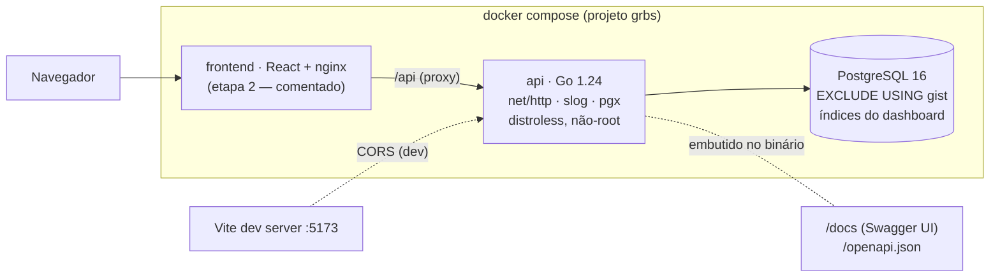

# go-react-business-suite

[](https://github.com/andreccls/go-react-business-suite/actions/workflows/ci.yml)
[](https://go.dev/)
[](https://www.postgresql.org/)
[](backend/internal/httpapi/openapi.json)
[](docs/TESTING.md)
[](LICENSE)

> ⚠️ **PROJETO DE EXEMPLO DE CÓDIGO (reference / sample) — NÃO É UM PRODUTO PRONTO PARA PRODUÇÃO.**
> Existe para demonstrar **uma solução completa para um negócio pequeno** (catálogo de serviços, clientes, agenda e painel de
> resultados) com backend em **Go** e, na etapa 2, frontend em **React** — junto com a documentação de arquitetura, escolhas técnicas e testes.
> O estúdio e os dados são **fictícios**. Segredos e senhas do `docker-compose.yml`/`.env.example` são **apenas de desenvolvimento**.
> Não o publique na internet como está: a lista honesta do que falta está em [Limitações conhecidas](#limitações-conhecidas-e-próximos-passos).

> 🚧 **Status: etapa 1 de 2 — o backend está completo e verificado; o frontend React vem em seguida** (a pasta `frontend/` está reservada
> e o `docker-compose.yml` já tem o serviço comentado). 🇬🇧 English summary: [README.en.md](README.en.md).

## O que é

**Studio Suite** — o sistema de um estúdio/clínica pequeno e fictício, com **um único prestador** (uma agenda):

- **Catálogo de serviços:** nome, descrição, duração (min), **preço em centavos**, ativo/inativo.
- **Clientes:** nome, e-mail único, telefone, observações.
- **Agenda:** cliente + serviço + início; o fim é **derivado** da duração do serviço, que junto com o preço fica **congelado (snapshot)** no
  agendamento. Sem sobreposição de horários, sem agendar no passado nem serviço inativo, com máquina de estados
  `scheduled → completed | cancelled | no_show`.
- **Painel de resultados (dashboard):** KPIs do período (receita realizada, agendamentos por status, taxas de cancelamento/no-show,
  ticket médio, novos clientes), série diária, top serviços e próximos agendamentos.
- **Acesso:** login com JWT curto + refresh rotativo; papéis `admin` e `staff` (staff não remove nada).

Foi desenhado com **SOLID idiomático, KISS e YAGNI**: só a stdlib para HTTP, 4 dependências diretas, sem ORM nem framework — cada escolha
está num [ADR](docs/adr). A regra mais delicada — **dois agendamentos nunca se sobrepõem, nem sob concorrência** — é garantida **pelo
banco** (restrição de exclusão do PostgreSQL) e provada por teste: 30 requisições simultâneas pelo mesmo horário → **1 × 201 e 29 × 409**.

## Arquitetura



Dentro da API, as interfaces (`booking.Repository`, `dashboard.Reader`, `auth.Store`…) são declaradas **no pacote que as consome**; o
domínio (`catalog`, `customer`, `booking`, `dashboard`, `auth`) não conhece HTTP nem SQL, e o mesmo conjunto de testes de contrato
roda contra o fake em memória e contra o PostgreSQL real. Diagramas detalhados (modelo de dados, fluxo de agendamento, máquina de estados,
mapa de erros) em [docs/ARCHITECTURE.md](docs/ARCHITECTURE.md).

## Estrutura do monorepo

```
.
├── backend/                         # ETAPA 1 (esta)
│   ├── cmd/api/main.go              # flags, sinais, os.Exit — nada de lógica
│   ├── internal/
│   │   ├── app/                     # composition root + Serve (graceful shutdown) + Healthcheck
│   │   ├── config/                  # env vars → Config; recusa segredo fraco em release
│   │   ├── catalog/ customer/       # catálogo e clientes: modelo, regras, Repository
│   │   ├── booking/                 # agendamentos: estados, snapshot, regras, Repository
│   │   ├── dashboard/ period/       # KPIs/série/ranking · período from/to no fuso do negócio
│   │   ├── auth/                    # usuários, bcrypt, JWT, refresh rotativo, papéis
│   │   ├── httpapi/                 # rotas, middleware, RFC 9457, CORS, openapi.json, swagger/ (embutidos)
│   │   ├── postgres/                # pgx + migrations/*.sql embutidas
│   │   ├── memstore/ repotest/ testdb/   # fakes · suítes de contrato · schema isolado por teste
│   │   └── ratelimit/ validation/   # token bucket · erros de campo, e-mail
│   ├── scripts/ (demo.sh, coverage-gate.sh)   Dockerfile (multi-stage, distroless)
├── frontend/                        # ETAPA 2 (reservada: .gitkeep)
├── docs/ (ARCHITECTURE.md, TESTING.md, adr/)
└── docker-compose.yml  Makefile  .env.example  .github/workflows/ci.yml
```

## Como rodar

Pré-requisito: **Docker** + `make` (e `curl`/`jq` para o demo). **Não precisa de Go no host** — tudo roda em contêineres, e um clone limpo
funciona **sem `.env`**.

```bash
make up      # PostgreSQL 16 + API (distroless, não-root)  ->  http://localhost:8095   (Swagger UI: /docs/)
make demo    # passeio completo com curl; termina conferindo os KPIs do dashboard com um cálculo manual
make test    # unit + PostgreSQL + concorrência, -race, com gate de cobertura
make lint    # gofmt + go vet + staticcheck
make down    # para tudo (mantém o volume do banco)   |   make clean: apaga volumes/imagens do projeto
```

Portas de host (em `127.0.0.1`, configuráveis via `.env`): API **8095**, PostgreSQL **5437**; projeto compose `grbs` (isola contêineres e volumes
de outros repositórios). O admin de desenvolvimento (`admin@example.com` / `dev-only-admin-password`) é criado na partida a partir de
`ADMIN_EMAIL`/`ADMIN_PASSWORD`. O `make demo` exige agenda vazia (um `make up` novo) porque confere números exatos.

### Configuração (variáveis de ambiente)

| Variável | Padrão | Descrição |
|---|---|---|
| `APP_ENV` | `release` | `release` (padrão, **estrito**) ou `development`. Em `release` a API **recusa subir** com `JWT_SECRET` < 32 caracteres, de baixa entropia ou parecido com placeholder, e com `ADMIN_PASSWORD` fraca. |
| `DATABASE_URL` | — (obrigatória) | URL do PostgreSQL |
| `JWT_SECRET` | — (obrigatória) | segredo HS256 (≥ 16 em `development`, ≥ 32 e não-placeholder em `release`) |
| `ADMIN_EMAIL` / `ADMIN_PASSWORD` | — | cria o admin inicial (idempotente); devem vir juntos |
| `BUSINESS_TZ` | `UTC` (o compose usa `America/Sao_Paulo`) | fuso IANA que define o "dia" dos filtros e do dashboard |
| `CORS_ALLOWED_ORIGINS` | vazio (CORS desligado) | origens permitidas, separadas por vírgula (`*` = qualquer). Em dev: `http://localhost:5173`. Em produção, nginx faz proxy e não precisa |
| `HTTP_ADDR` | `:8080` | endereço de escuta |
| `JWT_ACCESS_TTL` / `JWT_REFRESH_TTL` | `15m` / `168h` | validade dos tokens |
| `RATE_LIMIT_AUTH_PER_MIN` / `RATE_LIMIT_API_PER_MIN` | `10` / `120` | por IP em `/v1/auth/*` · por usuário nas demais rotas |
| `LOG_LEVEL` | `info` | `debug`, `info`, `warn`, `error` |

### Evidência: a stack real por curl (saída do `make demo`, resumida)

Executado em 2026-10-06 contra a stack de `make up` (imagem distroless + PostgreSQL 16), a partir de um banco vazio:

```text
== auth
401  protected route without token (401 missing_token)      401  login with a wrong password (401 invalid_credentials)
200  login admin  (expires_in=900s)     200  refresh (rotation)
401  reuse of the OLD refresh token (401, whole family revoked)
201  admin creates a staff user         403  staff cannot create users (403 forbidden)
== catalog and customers
422  invalid service  {"code":"validation_failed","errors":[{"field":"name",...},{"field":"duration_min",...},{"field":"price_cents",...}]}
409  duplicate e-mail (409 email_taken)
== booking rules (future agenda)
201  book Haircut 2026-10-08T14:00Z (30 min)   ends_at=2026-10-08T14:30:00Z price_cents=5000 status=scheduled
409  overlapping booking at 14:15   {"code":"slot_unavailable"}
201  back-to-back at 14:30 is fine
422  booking in the past            {"errors":[{"field":"starts_at","message":"must be in the future"}]}
422  inactive service               {"code":"service_inactive"}
409  same slot, other customer
== snapshot            PATCH Haircut price 5000 -> 9900 ... the appointment booked before still has price_cents=5000
== status transitions
409  complete a FUTURE appointment  {"code":"not_started"}      200  cancel      409  cancelled is terminal (invalid_transition)
201  the cancelled slot is free again          201  book Express check (5 min) starting in ~4 s
409  complete it before it starts (not_started)    ... sleep 5 ...    200  complete it after it started
```

**Os KPIs conferem com a soma manual.** O roteiro monta 19 agendamentos (14 de histórico inseridos por SQL — a API recusa o passado por desenho — e 5 criados pela
API) e calcula o esperado por conta própria a partir da mesma tabela, antes de consultar `GET /v1/dashboard/summary`:

```text
manual: total=19 scheduled=3 completed=11 cancelled=3 no_show=2 revenue=119000 ticket=10818
manual: revenue = 5000+20000+12000+20000+5000+12000+5000+5000+12000+20000+3000 = 119000      (11 agendamentos completed)
   ok   appointments_total                 expected 19       got 19
   ok   by_status  scheduled/completed/cancelled/no_show   expected 3/11/3/2    got 3/11/3/2
   ok   revenue_cents (completed only)     expected 119000   got 119000
   ok   average_ticket_cents               expected 10818    got 10818          (119000 / 11 = 10818,18)
   ok   cancellation_rate (3/19)           expected 0.1579   got 0.1579
   ok   no_show_rate (2/19)                expected 0.1053   got 0.1053
   ok   new_customers (4 created today)    expected 4        got 4
   ok   yesterday appointments / revenue   expected 2 / 25000 (5000+20000)       got 2 / 25000
   ok   daily series: 29 points, no holes; sum of the daily revenue = 119000
   ok   top service by realized revenue: Hair color (3 completed x 20000 = 60000), then Deep tissue massage 36000, Haircut 20000, Express check 3000
== demo finished: all dashboard numbers match the manual computation
```

Também verificados à mão: com `APP_ENV` não definido e os segredos de desenvolvimento, o contêiner **sai com código 1** listando
`JWT_SECRET is too weak for release mode` e `ADMIN_PASSWORD is too weak…`; `docker stop` (SIGTERM) loga `shutting down` e sai com código 0; o
*preflight* CORS (`OPTIONS` com `Origin: http://localhost:5173`) responde `204` com `Access-Control-Allow-Origin`, e uma origem não listada não recebe cabeçalhos CORS; a
imagem final roda como `nonroot:nonroot` (~5 MB).

Fluxo mínimo à mão:

```bash
API=http://localhost:8095; H='Content-Type: application/json'
TOKEN=$(curl -s -H "$H" $API/v1/auth/login -d '{"email":"admin@example.com","password":"dev-only-admin-password"}' | jq -r .access_token)
A="Authorization: Bearer $TOKEN"
SVC=$(curl -s -H "$A" -H "$H" $API/v1/services  -d '{"name":"Haircut","duration_min":30,"price_cents":5000}' | jq -r .id)
CUS=$(curl -s -H "$A" -H "$H" $API/v1/customers -d '{"name":"Ana Souza","email":"ana@example.com"}' | jq -r .id)
curl -s -H "$A" -H "$H" $API/v1/appointments -d "{\"customer_id\":\"$CUS\",\"service_id\":\"$SVC\",\"starts_at\":\"2030-01-07T14:00:00-03:00\"}"
curl -s -H "$A" "$API/v1/dashboard/summary?from=2030-01-01&to=2030-01-31"
```

## Endpoints

Contrato completo (schemas, exemplos, respostas) no Swagger UI em `/docs/` e em
[`backend/internal/httpapi/openapi.json`](backend/internal/httpapi/openapi.json) — **a fonte de verdade para o frontend**. Um teste falha se ele divergir do roteador.

| Método e rota | Acesso | Descrição | Respostas de erro |
|---|---|---|---|
| `POST /v1/auth/login` | público · rate limit/IP | `access_token` (JWT, 15 min) + `refresh_token` | 400 · 401 · 429 |
| `POST /v1/auth/refresh` | público · rate limit/IP | rotaciona o refresh (uso único; reuso revoga a família) | 400 · 401 · 429 |
| `POST /v1/auth/logout` | público · rate limit/IP | revoga um refresh token (204) | 400 · 429 |
| `GET /v1/auth/me` | autenticado | usuário atual (`id`, `email`, `role`) | 401 |
| `POST /v1/users` | **admin** | cria usuário (`admin` ou `staff`) | 403 · 409 · 422 |
| `POST /v1/services` · `GET /v1/services` | autenticado | cria · lista (`active`, `q`, `page`, `page_size`) | 422 |
| `GET /v1/services/{id}` · `PATCH` | autenticado | consulta · atualiza parcialmente (preço/duração não alteram o histórico) | 404 · 422 |
| `DELETE /v1/services/{id}` | **admin** | remove (se não houver agendamentos) | 403 · 404 · 409 `service_in_use` |
| `POST /v1/customers` · `GET /v1/customers` | autenticado | cria · lista (`q`, `page`, `page_size`) | 409 `email_taken` · 422 |
| `GET /v1/customers/{id}` · `PATCH` | autenticado | consulta · atualiza parcialmente | 404 · 409 · 422 |
| `DELETE /v1/customers/{id}` | **admin** | remove (se não houver agendamentos) | 403 · 404 · 409 `customer_in_use` |
| `POST /v1/appointments` | autenticado | **agenda** (snapshot, `ends_at` derivado) | 409 `slot_unavailable` · 422 (`service_inactive`, passado…) |
| `GET /v1/appointments` | autenticado | lista por início (`status`, `customer_id`, `from`, `to`, paginação) | 422 |
| `GET /v1/appointments/{id}` | autenticado | consulta | 404 |
| `PATCH /v1/appointments/{id}/status` | autenticado | `completed` · `no_show` · `cancelled` | 404 · 409 `invalid_transition`/`not_started` · 422 |
| `GET /v1/dashboard/summary` | autenticado | KPIs do período (`from`/`to`) | 422 |
| `GET /v1/dashboard/daily` | autenticado | série diária, zero-preenchida | 422 |
| `GET /v1/dashboard/top-services` | autenticado | ranking por receita realizada (`limit`) | 422 |
| `GET /v1/dashboard/upcoming` | autenticado | próximos agendamentos (`limit`) | 422 |
| `GET /healthz` · `GET /readyz` | público | liveness · readiness (consulta o banco) | 503 |
| `GET /docs/` · `GET /openapi.json` | público | Swagger UI e especificação (embutidos no binário) | — |

Todo `4xx/5xx` é `application/problem+json` (RFC 9457) com `code` estável e `request_id`; `422` traz `errors: [{field, message}]`; todas as
respostas levam `X-Request-ID`; `429` leva `Retry-After`. Listas respondem `{data, page, page_size, total}`. Dinheiro é **centavos inteiros**;
instantes são RFC 3339 UTC; `from`/`to` são datas `YYYY-MM-DD` **inclusivas** no fuso do negócio (máx. 366 dias).

### Regras de negócio → onde estão

| Regra | Onde / como é garantida |
|---|---|
| Horários não se sobrepõem (intervalo semiaberto; cancelado/no-show liberam) | `EXCLUDE USING gist` no PostgreSQL — [ADR 0002](docs/adr/0002-non-overlapping-agenda.md); teste de concorrência real |
| Não agendar no passado · não agendar serviço inativo | `booking.Service.Create` (422 `validation_failed` · 422 `service_inactive`) |
| `ends_at` = início + duração; preço/duração/nome congelados | `booking.Service.Create` — [ADR 0003](docs/adr/0003-price-duration-snapshot.md) |
| Transições válidas; `completed`/`no_show` só após o início | `Status.CanTransitionTo` + `Service.SetStatus`; escrita *compare-and-set* |
| Receita = soma dos `completed` (do snapshot); razões e ticket | `dashboard.Service` — [ADR 0004](docs/adr/0004-dashboard-aggregations.md) |
| `staff` não remove; só `admin` cria usuários | `AdminOnly` na tabela de rotas (`httpapi.routes`) |

## Testes

**227 casos de teste passando (0 falhas, 0 pulados), `-race`, cobertura total 97,7%** (gate ≥ 90%; domínio e serviços **100%**), `go vet`
e `staticcheck` limpos. Estratégia completa e exclusões justificadas em [docs/TESTING.md](docs/TESTING.md).

| Pacote | Cobertura | | Pacote | Cobertura |
|---|---|---|---|---|
| `catalog` · `customer` · `booking` · `dashboard` | **100%** | | `httpapi` | 99,7% |
| `period` · `validation` · `ratelimit` · `config` | **100%** | | `memstore` | 97,6% |
| `auth` | 98,6% (1 instrução inalcançável) | | `postgres` · `app` | 92,3% · 91,5% |

- **Contrato único, dois armazenamentos:** `internal/repotest` roda a mesma suíte no fake em memória e no PostgreSQL real (um *schema* por teste).
- **Concorrência:** 25 criações do mesmo horário no repositório (1 vence), 24 criações sobrepostas escalonadas (nunca duas gravadas) e **30 `POST`
  simultâneos pela pilha completa → 1 × 201 + 29 × 409**.
- **OpenAPI como oráculo:** toda resposta de todo teste de API é validada contra o `openapi.json` (status, content-type, schema, sem campos extras).
- O gate roda em `make test` e no CI; `REQUIRE_DB=1` impede que uma suíte de integração pulada passe como verde.

## Princípios → onde estão aplicados

| Princípio | Onde no código |
|---|---|
| **S** — Responsabilidade única | `booking.Service` só aplica regras de agenda; `dashboard.Service` só define indicadores; o repositório só agrega/persiste; `server.fail` é o **único** tradutor erro→HTTP; handlers só decodificam/chamam/codificam |
| **O** — Aberto/fechado | novo recurso = novo pacote + linhas em `routes()` + um `case` em `fail`; novo status/regra não reescreve o resto ([como adicionar](docs/ARCHITECTURE.md#8-como-adicionar-um-recurso-passo-a-passo)) |
| **L** — Substituição de Liskov | `memstore.*` e `postgres.*` satisfazem os mesmos contratos **comprovadamente**: `internal/repotest` roda nos dois |
| **I** — Segregação de interfaces | interfaces de 1–6 métodos declaradas por quem consome (`booking.Catalog` tem **1** método; `dashboard.Upcoming`, 1) |
| **D** — Inversão de dependência | o domínio define as interfaces e não importa `pgx` nem `net/http`; `app` liga as implementações |
| **YAGNI** | sem ORM, framework, cache, filas, multi-profissional, reagendamento, recorrência, pagamentos, down-migrations |
| **KISS** | erros são valores (`errors.Is/As`); máquina de estados em 3 linhas; uma tabela de rotas; a concorrência é resolvida por **uma** restrição do banco, sem locks |
| **DRY** | `decode`/`writeJSON`/`writeProblem` únicos; suíte de contrato única; a tabela de rotas alimenta o roteador **e** o teste da spec |

## Documentação

- [docs/ARCHITECTURE.md](docs/ARCHITECTURE.md) — pacotes, modelo de dados, fluxo de agendamento, máquina de estados, mapa de erros, OpenAPI, integração com o front e como adicionar um recurso.
- [docs/TESTING.md](docs/TESTING.md) — estratégia, números medidos, gate de cobertura e exclusões.
- [docs/adr/](docs/adr) — decisões: [stdlib vs framework](docs/adr/0001-stdlib-vs-framework.md) ·
  [agenda sem sobreposição](docs/adr/0002-non-overlapping-agenda.md) · [snapshot de preço/duração](docs/adr/0003-price-duration-snapshot.md) ·
  [agregações do dashboard (com `EXPLAIN`)](docs/adr/0004-dashboard-aggregations.md) · [JWT + refresh, papéis, CORS](docs/adr/0005-auth-jwt-refresh.md).
- Swagger UI embutido: `swagger-ui-dist` 5.33.1 (Apache-2.0), com a licença em [`backend/internal/httpapi/swagger/LICENSE`](backend/internal/httpapi/swagger/LICENSE).

## Limitações conhecidas e próximos passos

- **É um exemplo:** sem TLS (termine no proxy), sem métricas/tracing/auditoria, sem recuperação de senha nem verificação de e-mail,
  sem LGPD/retenção de dados de clientes. Os segredos do compose são de desenvolvimento.
- **Um único prestador.** Multi-profissional é o próximo passo natural: `provider_id` + `btree_gist` + `EXCLUDE (provider_id WITH =, tstzrange WITH &&)`
  ([ADR 0002](docs/adr/0002-non-overlapping-agenda.md)). Não há **reagendamento** (cancele e agende de novo), recorrência, lista de espera, horário de funcionamento/feriados
  nem bloqueio de agenda; um agendamento pode ser marcado em qualquer horário futuro (inclusive de madrugada).
- **Moeda única, sem pagamentos:** o preço é só o valor de tabela; "receita realizada" é a soma dos `completed`, não um fluxo de caixa.
- **O access token não é revogável:** vale até expirar (15 min) mesmo após o logout; HS256 com segredo compartilhado. Veja o [ADR 0005](docs/adr/0005-auth-jwt-refresh.md).
- **Rate limit em memória, por processo**, com chave = IP do par TCP (`X-Forwarded-For` não é confiado): atrás de proxy/NAT — **inclusive no Docker, onde todos
  os clientes aparecem com o IP do gateway** — o limite passa a ser compartilhado.
- **`PATCH` sem controle de versão** (última escrita vence); paginação por **offset**; busca `q` por `strpos(lower(…))` (varredura; `pg_trgm` resolveria em tabelas grandes).
- **O dashboard lê direto das tabelas:** rápido para o volume de uma agenda (ver o `EXPLAIN` no [ADR 0004](docs/adr/0004-dashboard-aggregations.md)), mas sem pré-agregação;
  os planos foram medidos uma vez, manualmente — não há *benchmark* automatizado.
- **Migrations só "up", aplicadas na partida** (com `pg_advisory_lock`): conveniência de demo; em produção, rode como job separado.
- **O `make demo` insere o histórico por SQL** (psql no contêiner do banco), porque a API recusa agendar no passado por desenho; os números do
  dashboard são os mesmos que a API calcula, mas esse passo não passa pela API.
- A imagem final é distroless/não-root, mas não foi escaneada por vulnerabilidades. O frontend (React + nginx) **ainda não existe** — é a etapa 2.

## Licença

[MIT](LICENSE) © 2026 André Coura.

---

## English summary

**go-react-business-suite** is a *reference/sample* project (not a production product): a small-business suite — service catalog, customers,
appointments on a single agenda, and a results dashboard — with a **Go 1.24 + PostgreSQL 16** backend (stdlib `net/http`, `slog`, `pgx`, 4 direct
dependencies) and, in stage 2, a **React** frontend. **Stage 1 (the backend) is done**; the frontend comes next. Highlights: appointments can **never overlap,
even under concurrency**, guaranteed by a PostgreSQL `EXCLUDE USING gist` constraint and proven by a real concurrency test (30 simultaneous
requests → 1 × 201 + 29 × 409); price and duration are **snapshotted** at booking time; dashboard KPIs are plain SQL aggregations with `EXPLAIN`
evidence; JWT access + rotating refresh tokens; RFC 9457 errors; an embedded OpenAPI 3 document (the frontend contract) that a test keeps identical to the
router. Run `make up && make demo` (Docker only, no Go on the host). See [README.en.md](README.en.md).
