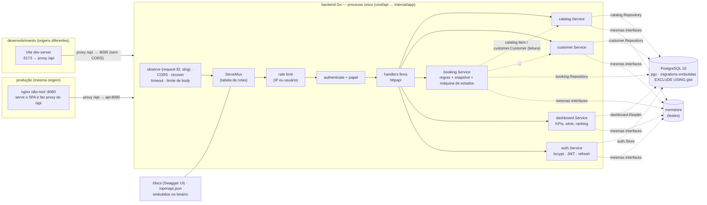
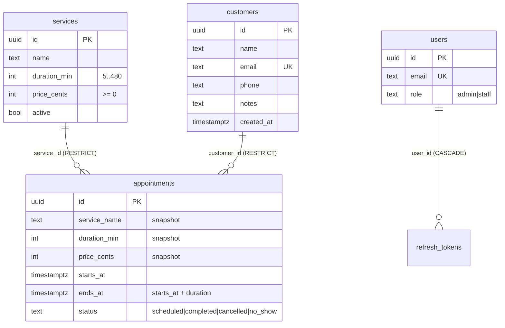
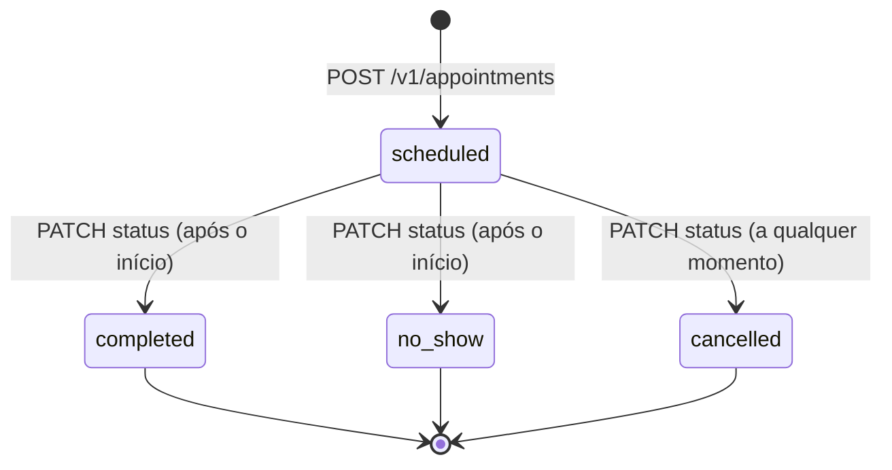
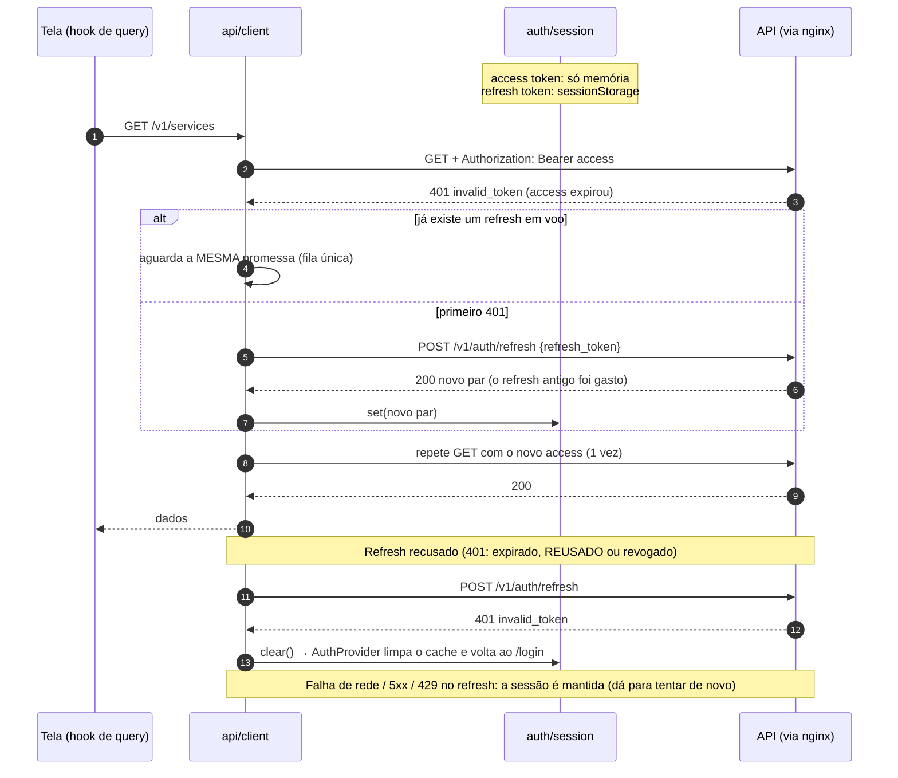

# Arquitetura

Este documento explica **como o backend está organizado e por quê** (§1–§8) e **como o frontend funciona** (§9). A filosofia do backend é a de
Go: pacotes por assunto, interfaces pequenas **declaradas por quem as usa**, sem camadas cerimoniais; a do frontend, poucas dependências
e estado de servidor separado do estado de interface. As decisões estão em [docs/adr](adr).

## 1. Visão geral



| Pacote | Papel | Importa (do projeto) |
|---|---|---|
| `cmd/api` | `main`: flags, sinais, `os.Exit`; embute `time/tzdata` | `app`, `config` |
| `internal/app` | composition root: liga tudo, `Serve` com *graceful shutdown*, `Healthcheck` | todos |
| `internal/config` | variáveis de ambiente → `Config`; recusa segredo fraco em `release`; fuso e CORS | — |
| `internal/catalog` | catálogo de serviços: modelo, validação, `Service`, `Repository` | `validation` |
| `internal/customer` | cadastro de clientes (e-mail único) | `validation` |
| `internal/booking` | **agendamentos**: máquina de estados, snapshot, regras, `Repository` | `catalog`, `customer`, `period`, `validation` |
| `internal/dashboard` | definições dos indicadores, série zero-preenchida, `Reader` | `booking`, `period`, `validation` |
| `internal/period` | `from`/`to` (datas inclusivas, fuso do negócio) → intervalo `[From, To)` | `validation` |
| `internal/auth` | usuários, bcrypt, JWT, refresh com rotação, papéis, `Store` | `validation` |
| `internal/httpapi` | rotas, middleware, JSON, RFC 9457, CORS, OpenAPI + Swagger UI | todos os de domínio, `ratelimit` |
| `internal/postgres` | `pgx`, migrations embutidas; implementa os `Repository`/`Reader`/`Store` | domínio |
| `internal/memstore` | implementações em memória (testes) sobre um `DB` compartilhado | domínio |
| `internal/repotest`, `internal/testdb` | suítes de contrato compartilhadas; schema isolado por teste | — |
| `internal/ratelimit`, `internal/validation` | token bucket; erros por campo, e-mail, dígitos | — |

**Regra de dependência:** o domínio (`catalog`, `customer`, `booking`, `dashboard`, `auth`) não importa `httpapi`, `postgres` nem `pgx`.
`httpapi` não importa `postgres`. Só `app` conhece todos. O compilador recusa ciclos.

## 2. Modelo de dados



`appointments` carrega a restrição `appointments_no_overlap` ([ADR 0002](adr/0002-non-overlapping-agenda.md)) e os índices do
dashboard ([ADR 0004](adr/0004-dashboard-aggregations.md)). As migrações são SQL puro, embutidas no binário, aplicadas na partida com
`pg_advisory_lock` (várias instâncias subindo juntas aplicam uma de cada vez).

## 3. Fluxo: agendar (e por que não há corrida)

`POST /v1/appointments` por um `staff`:

```mermaid
sequenceDiagram
    autonumber
    participant C as Cliente HTTP
    participant H as httpapi.createAppointment
    participant B as booking.Service
    participant K as catalog / customer
    participant R as postgres.Appointments
    participant P as PostgreSQL

    C->>H: POST {customer_id, service_id, starts_at}
    Note over H: observe → CORS → recover → limits → rate limit → authenticate
    H->>H: decode (JSON estrito)
    H->>B: Create(input)
    B->>B: valida: início no futuro, ids, notas
    B->>K: Get(customer), Get(service)
    K-->>B: cliente + serviço (ativo?)
    B->>B: snapshot: nome, duração, preço; ends_at = início + duração
    B->>R: Create(appointment)
    R->>P: INSERT … (checa EXCLUDE no GiST, atomicamente)
    alt horário livre
        P-->>R: ok
        R-->>H: ok → 201 + Location
    else sobreposição (SQLSTATE 23P01)
        P-->>R: exclusion_violation
        R-->>B: ErrSlotTaken
        B-->>H: ErrSlotTaken → 409 slot_unavailable (RFC 9457)
    end
```

## 4. Máquina de estados



- `CanTransitionTo` é a máquina inteira (3 linhas): só `scheduled` se move; os outros três estados são terminais.
- `completed`/`no_show` antes do horário de início → `409 not_started`. Qualquer outra transição → `409 invalid_transition`.
- A escrita é um *compare-and-set* (`UPDATE … WHERE id = $1 AND status = $2`): duas transições simultâneas não se atropelam.

## 5. Fluxo de uma requisição e mapa de erros

Ordem dos *middlewares* (de fora para dentro): `observe` (request ID, cabeçalho `nosniff`, *access log* `slog`) → `cors` (o *preflight*
responde aqui, sem autenticação nem rate limit) → `recoverer` (pânico → 500) → `limits` (timeout de 8 s e corpo de 1 MiB) → `ServeMux` →
`protect` por rota (rate limit → autenticação → papel) → handler fino.

`server.fail` é o **único** tradutor erro → HTTP (RFC 9457, `type: about:blank`, `code` estável, `request_id`):

| Erro de domínio | Status | `code` |
|---|---|---|
| `validation.Errors` | 422 | `validation_failed` (+ `errors[{field,message}]`) |
| JSON inválido / campo desconhecido | 400 | `invalid_json` |
| corpo > 1 MiB / tipo ≠ JSON | 413 / 415 | `body_too_large` / `unsupported_media_type` |
| `catalog/customer/booking.ErrNotFound` (inclui id malformado) | 404 | `service_not_found` / `customer_not_found` / `appointment_not_found` |
| `ErrEmailTaken` | 409 | `email_taken` |
| `booking.ErrSlotTaken` | 409 | `slot_unavailable` |
| `booking.ErrInvalidTransition` / `ErrNotStarted` | 409 | `invalid_transition` / `not_started` |
| `catalog.ErrInUse` / `customer.ErrInUse` | 409 | `service_in_use` / `customer_in_use` |
| `booking.ErrUnknownReference` (cliente/serviço removido entre a leitura e a escrita) | 409 | `unknown_reference` |
| `booking.ErrServiceInactive` | 422 | `service_inactive` |
| `auth.ErrInvalidCredentials` / `ErrInvalidToken` / sem token | 401 | `invalid_credentials` / `invalid_token` / `missing_token` |
| papel insuficiente | 403 | `forbidden` |
| rate limit | 429 | `rate_limited` (+ `Retry-After`) |
| `context.DeadlineExceeded` | 503 | `timeout` |
| qualquer outro | 500 | `internal_error` (a causa só vai para o log) |

## 6. Contrato OpenAPI que nunca diverge

`internal/httpapi/openapi.json` (3.0.3) é embutido no binário e servido em `/openapi.json`, com Swagger UI em `/docs/` (assets
vendorizados, sem CDN; carrega a spec por caminho **relativo**, então funciona também sob `/api/docs/` atrás do nginx). Três testes
o mantêm fiel — sem banco e sem `.env`:

1. `TestOpenAPIMatchesRouter`: compara a tabela `routes()` com a spec (todo endpoint existe nos dois lados; segurança, 401/403/429, corpo, `operationId` único, `404` em `{id}`).
2. Todo teste de API passa por `env.do`, que **valida cada resposta contra a spec**: status declarado, `Content-Type` declarado e corpo conforme o schema (tipos,
   obrigatórios, **campos não declarados são erro**, formatos `date-time`/`date`/`uuid`).
3. `TestOpenAPIReferencesResolve` (nenhum `$ref` quebrado, nenhum componente morto) e `TestOpenAPIExamplesMatchTheirSchemas` (os exemplos que o frontend vai copiar são válidos).

## 7. Como o frontend se conecta

- **Produção (compose):** o serviço `frontend` (nginx não-root, porta de host **8096**) serve o SPA e faz `location /api/ { proxy_pass http://api:8080/; }`.
  Mesma origem: **sem CORS**. Swagger UI da API em `/api/docs/`. Ver [ADR 0009](adr/0009-nginx-proxy-csp.md).
- **Dev (`make frontend-dev`):** Vite em contêiner com o **mesmo caminho `/api`**, encaminhado por um proxy do Vite para a API — também sem CORS.
  Se alguém apontar `VITE_API_BASE` direto para `http://localhost:8095`, aí vale o `CORS_ALLOWED_ORIGINS` da API.
- **Contrato:** `backend/internal/httpapi/openapi.json` é a fonte da verdade; os tipos do front são **gerados** dele e conferidos no CI
  ([ADR 0007](adr/0007-generated-api-types.md)). Dinheiro = **centavos inteiros**; instantes = RFC 3339 UTC; dias de calendário (`from`/`to`,
  séries) = `YYYY-MM-DD` no fuso do negócio.

## 8. Como adicionar um recurso (passo a passo)

1. Crie `internal/<recurso>/` com o modelo, o `Service` (validação e regras) e a interface `Repository`, e erros de domínio.
2. Implemente no `internal/memstore` e no `internal/postgres` (+ migração `000N_*.sql`) e **escreva a suíte em `internal/repotest`**,
   rodando-a nos dois (`memstore_test.go` e `postgres_test.go`).
3. Em `internal/httpapi`: declare a interface do serviço em `server.go`, acrescente linhas em `routes()`, escreva os handlers, um `case` em `fail`.
4. Atualize `openapi.json` (paths + schemas + exemplos): os testes de contrato dizem exatamente o que faltou.
5. Ligue no `internal/app/app.go`.

## 9. Frontend (React + TypeScript + Vite)

### 9.1 Estrutura

```
frontend/
├── Dockerfile, nginx/                # build em dois estágios → nginx não-root, CSP, proxy /api
├── vite.config.ts                    # dev proxy /api, Vitest, gate de cobertura
├── eslint.config.js                  # typescript-eslint + react-hooks + jsx-a11y
└── src/
    ├── main.tsx · App.tsx            # providers (Query, Router, Auth) · tabela de rotas
    ├── api/
    │   ├── schema.d.ts               # GERADO do openapi.json (npm run gen:api) — não editar
    │   ├── types.ts                  # apelidos legíveis dos tipos gerados
    │   ├── client.ts                 # fetch fino: RFC 9457 → ApiError, refresh de fila única, 1 retry
    │   ├── endpoints.ts              # uma função tipada por operação do contrato
    │   ├── hooks.ts                  # TanStack Query: leituras (keys) e escritas (invalidação)
    │   └── errors.ts                 # ApiError + mensagens pt-BR por `code`
    ├── auth/                         # session.ts (tokens) · AuthContext (sessão) · RequireAuth/RequireAdmin
    ├── lib/                          # datetime (fuso do negócio) · format (R$, datas) · validation · queryClient
    ├── components/                   # Layout, Modal, ConfirmDialog, Field, States, Pagination, StatusBadge, DailyChart
    ├── pages/                        # Login, Dashboard, Appointments(+Form), Services, Customers, Users, NotFound
    ├── styles.css                    # tokens (claro/escuro por prefers-color-scheme) e componentes
    └── test/                         # setup (MSW), mockApi (fake com estado, tipado pelo contrato), utils
```

Dependências entre camadas: `pages → components, api/hooks, auth, lib`; `api/hooks → api/index (cliente + endpoints) → auth/session`;
`lib` não importa nada do app. Páginas **não chamam `fetch`**: só hooks.

### 9.2 Autenticação e refresh (sequência)



*Reload:* o access token se foi, o refresh token está no `sessionStorage`; a primeira chamada autenticada faz o refresh **antes** de enviar
(`AuthProvider` chama `/v1/auth/me`). Detalhes e a limitação de XSS: [ADR 0008](adr/0008-token-storage.md).

### 9.3 Estado de servidor e de interface

- **Servidor:** TanStack Query ([ADR 0006](adr/0006-server-state-tanstack-query.md)). Leituras com *key* = recurso + parâmetros; escritas invalidam
  os recursos afetados (`appointments`, `dashboard`…); depois de um `409` a lista é recarregada, nunca "consertada" no cliente.
- **Interface:** `useState` local (modal aberto, filtros, página). Busca digitada passa por `useDebounced` (300 ms).
- **Erros:** todo erro vira `ApiError` (`status`, `code`, `fields`, `requestId`, `retryAfter`); `errorMessage` traduz o `code` para uma frase em
  português (ex.: `slot_unavailable` → "Esse horário conflita com outro agendamento…"); `422` vira erro **por campo** (`fieldErrorsFrom`).
- **Permissões:** `staff` não vê "Excluir" nem o menu "Usuários" (`/usuarios` mostra "Acesso restrito"); isso é **conveniência** — quem impõe é a API (`403`),
  e o front também mostra esse `403` se o papel mudar durante a sessão.
- **Tempo:** o fuso do negócio vem de `VITE_BUSINESS_TZ` (injetado no *build*, padrão `America/Sao_Paulo`, igual ao `BUSINESS_TZ` do compose). Datas
  digitadas (dia + hora) viram instante UTC por `zonedToInstant`; instantes viram texto pelo mesmo fuso. "Concluir/Faltou" só habilitam depois do início
  (relógio do navegador); o servidor é a autoridade (`409 not_started` é tratado).

### 9.4 Como adicionar uma tela (passo a passo)

Exemplo: tela de **Profissionais** (`GET /v1/providers`) depois que o backend a oferecer.

1. **Contrato primeiro:** o backend atualiza `openapi.json` (§8). No front, `make frontend-types` regenera `schema.d.ts`; `make frontend-lint` falha se você esquecer.
2. **Tipos e chamadas:** apelidos em `src/api/types.ts` (`Provider`, `ProviderQuery`) e as funções em `src/api/endpoints.ts` (`listProviders`, `createProvider`…).
3. **Hooks:** em `src/api/hooks.ts`, `useProviders(q)` (*key* `['providers', q]`) e as mutações que invalidam `providers` (e o que mais for afetado).
4. **Página:** `src/pages/ProvidersPage.tsx` usando `Loading`/`ErrorState`/`Empty`, `Field`, `Modal`, `Pagination` e as classes `table.data.stack` (vira *cards* no celular).
   Mensagens de erro novas: um `code` em `MESSAGES` (`api/errors.ts`). Validação: uma função pura em `lib/validation.ts`.
5. **Rota e menu:** uma `<Route>` em `App.tsx` (embrulhe com `RequireAdmin` se for só de admin) e um `NavLink` em `components/Layout.tsx`.
6. **Testes:** rotas no fake `src/test/mockApi.ts` (tipadas com os tipos gerados) e `src/pages/providers.test.tsx` cobrindo lista, vazio, erro, criação com `422`/`409`
   e a permissão. `make frontend-coverage` mantém o gate; `make lint` checa acessibilidade estática (jsx-a11y).
