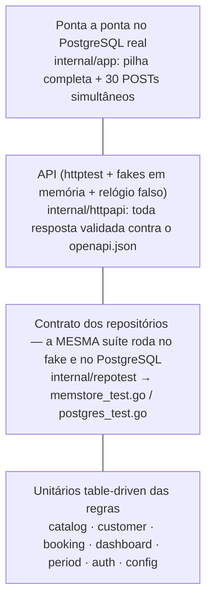

# Estratégia de testes

Tudo roda em Docker (`make test`) — nada de Go no host. Números **medidos** em 2026-10-06 (Go 1.24, PostgreSQL 16, `-race`).

| Item | Resultado |
|---|---|
| Casos de teste (funções + subtestes) | **227** passando, **0** falhas, **0** pulados |
| Cobertura total (instruções, `internal/*` exceto `testdb`/`repotest`) | **97,7%** (mínimo do gate: 90%) |
| Domínio e serviços (`catalog`, `customer`, `booking`, `dashboard`, `period`, `validation`, `ratelimit`, `config`) | **100%** |
| `auth` | 98,6% (gate 98%: uma instrução inalcançável, ver exclusões) |
| `httpapi` · `memstore` · `postgres` · `app` | 99,7% · 97,6% · 92,3% · 91,5% |
| `go vet` · `staticcheck` · `gofmt` | limpos |

## Pirâmide



1. **Unitários das regras (TDD no domínio).** `stdlib testing`, em tabela, com o fake em memória e *stubs* mínimos para os caminhos de erro. Cada
   regra do enunciado tem um caso nomeado: início no passado, serviço inativo, cliente/serviço desconhecido, snapshot de preço/duração,
   `ends_at` derivado, todas as 16 combinações da máquina de estados, `completed`/`no_show` antes do início, período inválido,
   razões sem divisão por zero, arredondamento do ticket médio, série zero-preenchida.
2. **Contrato dos repositórios (`internal/repotest`).** Cada interface de armazenamento (`catalog.Repository`, `customer.Repository`,
   `booking.Repository`, `dashboard.Reader`, `auth.Store`) tem **uma** suíte; ela roda contra `memstore` (sem banco) e contra o
   **PostgreSQL real** (um *schema* isolado por teste, `internal/testdb`). Assim o fake dos testes de serviço/API **não pode divergir**
   do banco — e o comportamento que só o banco dá (restrição de exclusão, FK `RESTRICT`, `AT TIME ZONE`) é verificado de verdade.
3. **Concorrência.** (a) contrato: 25 criações simultâneas do mesmo horário → exatamente 1 vence; 24 criações escalonadas que se
   sobrepõem → nenhum par sobreposto é gravado; (b) API em memória: 20 `POST` simultâneos; (c) **pilha completa no PostgreSQL**: 30 `POST`
   simultâneos → **1 × 201 e 29 × 409**. Tudo com `-race`. Ver [ADR 0002](adr/0002-non-overlapping-agenda.md).
4. **API (`internal/httpapi`).** `httptest` sobre o handler real, com relógio injetável. O `openapi.json` é o **oráculo**: cada
   requisição feita por qualquer teste é conferida contra ele (status, `Content-Type`, corpo conforme o schema, nenhum campo extra) — se o
   código passar a devolver um campo que a spec não declara, o teste falha. Também: CORS (preflight, origem não permitida, `*`),
   request ID, *access log*, pânico recuperado, timeout, rate limit, 500 sem vazar a causa, tabela erro → status/`code`.
5. **Ponta a ponta (`internal/app`).** `app.New` contra PostgreSQL real: migrações idempotentes, *seed* do admin, fluxo completo,
   integridade referencial virando 409, *graceful shutdown*, `-healthcheck`.
6. **Demo (`make demo`).** O roteiro com `curl` contra a stack em contêineres confere os KPIs contra um cálculo manual (ver README).

## O gate de cobertura

`make test` e o CI rodam `go test -race -coverpkg=<todos os pacotes internos exceto testdb/repotest>` e então
`scripts/coverage-gate.sh`, que **falha** se a cobertura total < 90% ou se um pacote central ficar abaixo do mínimo
(100% em `catalog`, `customer`, `booking`, `dashboard`, `period`, `validation`, `ratelimit`; 98% em `auth`). Como cada
binário de teste grava a sua cópia dos blocos, o script funde por bloco (conta como coberto se **qualquer** binário o executou).

`REQUIRE_DB=1` (Makefile e CI) transforma "banco não configurado" em **falha**, não em *skip*: uma suíte de integração silenciosamente
pulada não é um build verde. `make test-unit` roda sem banco (os testes de PostgreSQL são pulados — só para laço rápido local).

### Exclusões e lacunas (todas justificadas)

- **`internal/testdb` e `internal/repotest`** ficam fora da medida: são *helpers* de teste, não código de produção.
- **`cmd/api`** não entra no gate (`main` só com `flag`, sinais e `os.Exit`, sem lógica); o caminho de partida é coberto por `internal/app`.
- **`internal/auth` — 1 instrução (98,6%):** o `return` de erro de `SignedString` com HS256 — não há entrada que o faça falhar (o gate declara 98% por isso).
- **`internal/postgres` (92,3%) e `internal/app` (91,5%):** o que sobra são ramos defensivos que exigem um banco falhando **no meio** de uma
  operação (`rows.Err()`, erro de `Scan`, falha de uma migração já iniciada, `Shutdown` com timeout). Os erros de banco *fora* do
  meio da operação são cobertos (`TestRepositoriesSurfaceDatabaseErrors`, com o *pool* fechado, também verifica que uma falha de banco
  **nunca** vira erro de domínio como "não encontrado" ou "horário ocupado").
- **`internal/memstore` (97,6%):** desempates de ordenação que a massa dos testes não exercita (a ordem final é garantida em SQL
  e testada no contrato do PostgreSQL).
- Não há teste de carga nem de desempenho automatizado: a prova de índices é o `EXPLAIN` do [ADR 0004](adr/0004-dashboard-aggregations.md) (manual).

## Como rodar

```bash
make test        # tudo (unit + PostgreSQL + concorrência) com -race + gate de cobertura
make test-unit   # sem banco, só o que roda em memória
make coverage    # idem test + relatório por função (backend/coverage.html)
make lint        # gofmt + go vet + staticcheck
make demo        # com `make up`: roteiro curl que confere os KPIs
```

Um clone limpo passa sem `.env`: o `docker-compose.yml` tem padrões de desenvolvimento para todas as variáveis.
