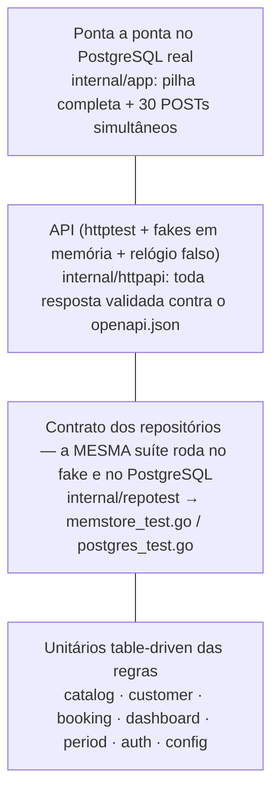

# Estratégia de testes

Tudo roda em Docker (`make test`) — nada de Go **nem de Node** no host. Números **medidos** em 2026-10-06. Duas suítes: **backend** (Go 1.24, PostgreSQL 16, `-race`) e **frontend** (Vitest 3 + Testing Library + MSW, mais um E2E Playwright contra a pilha completa).

### Backend

| Item | Resultado |
|---|---|
| Casos de teste (funções + subtestes) | **227** passando, **0** falhas, **0** pulados |
| Cobertura total (instruções, `internal/*` exceto `testdb`/`repotest`) | **97,7%** (mínimo do gate: 90%) |
| Domínio e serviços (`catalog`, `customer`, `booking`, `dashboard`, `period`, `validation`, `ratelimit`, `config`) | **100%** |
| `auth` | 98,6% (gate 98%: uma instrução inalcançável, ver exclusões) |
| `httpapi` · `memstore` · `postgres` · `app` | 99,7% · 97,6% · 92,3% · 91,5% |
| `go vet` · `staticcheck` · `gofmt` | limpos |

## Pirâmide



1. **Unitários das regras (TDD no domínio).** `stdlib testing`, em tabela, com o fake em memória e *stubs* mínimos para os caminhos de erro. Cada
   regra do enunciado tem um caso nomeado: início no passado, serviço inativo, cliente/serviço desconhecido, snapshot de preço/duração,
   `ends_at` derivado, todas as 16 combinações da máquina de estados, `completed`/`no_show` antes do início, período inválido,
   razões sem divisão por zero, arredondamento do ticket médio, série zero-preenchida.
2. **Contrato dos repositórios (`internal/repotest`).** Cada interface de armazenamento (`catalog.Repository`, `customer.Repository`,
   `booking.Repository`, `dashboard.Reader`, `auth.Store`) tem **uma** suíte; ela roda contra `memstore` (sem banco) e contra o
   **PostgreSQL real** (um *schema* isolado por teste, `internal/testdb`). Assim o fake dos testes de serviço/API **não pode divergir**
   do banco — e o comportamento que só o banco dá (restrição de exclusão, FK `RESTRICT`, `AT TIME ZONE`) é verificado de verdade.
3. **Concorrência.** (a) contrato: 25 criações simultâneas do mesmo horário → exatamente 1 vence; 24 criações escalonadas que se
   sobrepõem → nenhum par sobreposto é gravado; (b) API em memória: 20 `POST` simultâneos; (c) **pilha completa no PostgreSQL**: 30 `POST`
   simultâneos → **1 × 201 e 29 × 409**. Tudo com `-race`. Ver [ADR 0002](adr/0002-non-overlapping-agenda.md).
4. **API (`internal/httpapi`).** `httptest` sobre o handler real, com relógio injetável. O `openapi.json` é o **oráculo**: cada
   requisição feita por qualquer teste é conferida contra ele (status, `Content-Type`, corpo conforme o schema, nenhum campo extra) — se o
   código passar a devolver um campo que a spec não declara, o teste falha. Também: CORS (preflight, origem não permitida, `*`),
   request ID, *access log*, pânico recuperado, timeout, rate limit, 500 sem vazar a causa, tabela erro → status/`code`.
5. **Ponta a ponta (`internal/app`).** `app.New` contra PostgreSQL real: migrações idempotentes, *seed* do admin, fluxo completo,
   integridade referencial virando 409, *graceful shutdown*, `-healthcheck`.
6. **Demo (`make demo`).** O roteiro com `curl` contra a stack em contêineres confere os KPIs contra um cálculo manual (ver README).

## O gate de cobertura

`make test` e o CI rodam `go test -race -coverpkg=<todos os pacotes internos exceto testdb/repotest>` e então
`scripts/coverage-gate.sh`, que **falha** se a cobertura total < 90% ou se um pacote central ficar abaixo do mínimo
(100% em `catalog`, `customer`, `booking`, `dashboard`, `period`, `validation`, `ratelimit`; 98% em `auth`). Como cada
binário de teste grava a sua cópia dos blocos, o script funde por bloco (conta como coberto se **qualquer** binário o executou).

`REQUIRE_DB=1` (Makefile e CI) transforma "banco não configurado" em **falha**, não em *skip*: uma suíte de integração silenciosamente
pulada não é um build verde. `make test-unit` roda sem banco (os testes de PostgreSQL são pulados — só para laço rápido local).

### Exclusões e lacunas (todas justificadas)

- **`internal/testdb` e `internal/repotest`** ficam fora da medida: são *helpers* de teste, não código de produção.
- **`cmd/api`** não entra no gate (`main` só com `flag`, sinais e `os.Exit`, sem lógica); o caminho de partida é coberto por `internal/app`.
- **`internal/auth` — 1 instrução (98,6%):** o `return` de erro de `SignedString` com HS256 — não há entrada que o faça falhar (o gate declara 98% por isso).
- **`internal/postgres` (92,3%) e `internal/app` (91,5%):** o que sobra são ramos defensivos que exigem um banco falhando **no meio** de uma
  operação (`rows.Err()`, erro de `Scan`, falha de uma migração já iniciada, `Shutdown` com timeout). Os erros de banco *fora* do
  meio da operação são cobertos (`TestRepositoriesSurfaceDatabaseErrors`, com o *pool* fechado, também verifica que uma falha de banco
  **nunca** vira erro de domínio como "não encontrado" ou "horário ocupado").
- **`internal/memstore` (97,6%):** desempates de ordenação que a massa dos testes não exercita (a ordem final é garantida em SQL
  e testada no contrato do PostgreSQL).
- Não há teste de carga nem de desempenho automatizado: a prova de índices é o `EXPLAIN` do [ADR 0004](adr/0004-dashboard-aggregations.md) (manual).

## Frontend

Medido com `make frontend-coverage` (Node 22, Vitest 3, jsdom, cobertura V8):

| Item | Resultado |
|---|---|
| Arquivos de teste · casos | **15** · **188** passando, 0 falhas, 0 pulados |
| Cobertura total (instruções · *branches* · funções · linhas) | **99,89% · 98,10% · 96,45% · 99,89%** (gate: ≥ 90% em cada) |
| `src/lib` (formatação, datas/fuso, validação, retry) | 100% linhas · 97,05% *branches* (gate: ≥ 95% / 90%) |
| `src/api/client.ts` (o cliente HTTP com refresh) | **100% linhas · 100% *branches*** (gate: ≥ 95% / 90%) |
| `src/api/errors.ts` · `src/components` · `src/pages` | 100% · 100% · 100% linhas (funções de `pages`: 92%) |
| ESLint (typescript-eslint, react-hooks, **jsx-a11y**) · `tsc --noEmit` (strict + `noUncheckedIndexedAccess`) | limpos |
| Tipos gerados × `openapi.json` (`npm run check:api`) | em dia (o CI falha se divergirem) |
| E2E (Playwright, Chromium, pilha completa) | **5** passando: `make e2e` |
| *Bundle* de produção | JS **344,7 kB (106,5 kB gzip)** · CSS 9,4 kB (2,7 kB gzip) · imagem nginx ~82 MB |

### O que cada camada testa

1. **Funções puras (`lib/`).** Dinheiro **a partir de centavos** (`R$ 1.190,00`) e o caminho inverso **por texto** (`1.200,50` → 120050; `19,90` nunca vira
   `1989.999…`); datas no **fuso do negócio** (01:00 UTC ainda é o dia anterior em São Paulo), conversão *wall clock* → UTC inclusive na virada de horário
   de verão (Nova York, 2026-03-08), aritmética de dias (mês/ano/bissexto), validação espelhando os limites do contrato, política de *retry*.
2. **Cliente HTTP (`api/client.test.ts`)** com um `fetch` roteirizado, para controlar a ordem dos eventos: `Bearer` e serialização da *query*; `401` → **um**
   refresh → **uma** repetição; **N requisições simultâneas com `401` compartilham UM refresh**; um `401` que chega *depois* de outro refresh só repete;
   *reload* (só o refresh token) renova **antes** da primeira chamada; refresh recusado (expirado/**reusado**/revogado) → sessão limpa e assinantes avisados;
   falha de rede/`5xx` no refresh **mantém** a sessão; sem tokens → `missing_token`; no máximo uma repetição; problema RFC 9457 → `ApiError` com campos,
   `request_id` e `Retry-After`; corpo não-JSON (página de erro do proxy) → `unexpected_response`.
3. **Componentes** (`components/components.test.tsx`): `Field` liga rótulo/dica/erro (`aria-describedby`, `aria-invalid`); `Modal` é `role="dialog"` rotulado, foca o primeiro
   campo, **prende o Tab**, fecha com Escape/fundo e **devolve o foco**; `Pagination`; estados (`status`/`alert`); `StatusBadge` com texto (cor nunca é a única pista);
   `DailyChart` (eixo, alternativa em texto, tabela, série vazia).
4. **Fluxos de tela com MSW** (`auth/auth.test.tsx`, `pages/*.test.tsx`): um **fake da API com estado**, escrito a partir do `openapi.json` e **tipado com os tipos gerados**
   (`src/test/mockApi.ts`: login/refresh rotativo com detecção de reuso, sobreposição de horários, `not_started`, `service_in_use`, 403 de papel…). Cobrem:
   login (credencial errada, campos vazios, `429` com `Retry-After`, `/me` falhando), **restauração após reload**, **expiração no meio da sessão** (refresh transparente e rotação),
   **refresh revogado → login**, logout que revoga no servidor; **agendar com `409 slot_unavailable`** (mensagem clara, diálogo continua aberto, nada criado) e `422` no campo;
   *Concluir/Faltou* desabilitados antes do início, concluir, faltou, cancelar com confirmação, recusas do servidor (`not_started`, `invalid_transition`);
   **permissões** (staff não vê "Excluir" nem "Usuários"; `/usuarios` → "Acesso restrito"; admin exclui; `409 service_in_use`/`customer_in_use` explicados; `403` mostrado);
   formatação (R$, `14:00` a partir de `17:00Z`), estados **vazio**, **erro com "Tentar novamente"** e carregando em toda tela; filtros, busca (*debounce*), paginação, período inválido no painel.
5. **E2E (`e2e/`, Playwright no contêiner oficial, na rede do compose, contra nginx + API + PostgreSQL reais):** (a) admin cria serviço e dois clientes, agenda, **provoca o 409**,
   vê o contador do painel subir, cancela e tenta excluir o serviço em uso; (b) cria um *staff*, entra como ele: sem "Excluir"/"Usuários", sessão **sobrevive ao reload**, `/usuarios` negado;
   (c) senha errada; (e) **celular (360 px): nenhuma página precisa de rolagem horizontal** (pegou um bug real de *overflow* no painel, corrigido); (d) **só teclado**: *skip link*, foco dentro do diálogo (Shift+Tab não escapa), Escape devolve o foco ao botão, **console sem erros** (404/409 esperados e o aviso do COOP em `http://frontend`
   são ignorados). `./e2e/run.sh screenshots` regenera `docs/images/`.

### Gate de cobertura e exclusões (frontend)

`npm run coverage` (`make frontend-coverage`, `make test`, CI) **falha** se o total ficar abaixo de 90% (instruções/*branches*/funções/linhas) ou se `src/lib/**` ou
`src/api/client.ts` ficarem abaixo de 95% (linhas/instruções/funções) / 90% (*branches*). Excluídos da medida, com motivo:

- **`src/main.tsx`** — só `createRoot(...).render(...)` (a montagem dos *providers* é exercida pelos testes via `src/test/utils.tsx`, que monta os mesmos).
- **`src/api/schema.d.ts`** — gerado (só tipos, sem código executável); a fidelidade é verificada por `check:api`.
- **`src/test/**`, `*.test.ts(x)`, `src/vite-env.d.ts`** — são os próprios testes/*helpers*/declarações.

Lacunas conhecidas (já dentro do gate): `src/auth/session.ts` 95,2% (o `catch` de `window.sessionStorage` inacessível não é alcançável no jsdom — o caminho de `Storage` que lança
é coberto com um *Storage* falso); `AuthContext.tsx` 87,5% de *branches* (ramos defensivos de cancelamento ao desmontar); `api/index.ts` (o padrão `'/api'` de `VITE_API_BASE`: os testes
setam a variável). **Não** há teste visual/regressão de *pixels*, nem E2E em Firefox/WebKit, nem auditoria automática de contraste (axe): a acessibilidade é verificada por
`jsx-a11y` (estático), consultas por papel/rótulo do Testing Library (a árvore de acessibilidade), o E2E de teclado e conferência manual de contraste nos dois temas.

## Como rodar

```bash
make test        # tudo (unit + PostgreSQL + concorrência) com -race + gate de cobertura
make test-unit   # sem banco, só o que roda em memória
make coverage    # idem test + relatório por função (backend/coverage.html)
make lint        # gofmt + go vet + staticcheck  +  ESLint + tsc + tipos gerados em dia
make demo        # com `make up`: roteiro curl que confere os KPIs

make frontend-test        # Vitest (sem cobertura)          make frontend-coverage   # com o gate
make frontend-lint        # ESLint + tsc + check:api        make frontend-types      # regenera src/api/schema.d.ts
make up && make e2e       # Playwright contra a pilha completa (baixa a imagem oficial, ~1,5 GB; ver abaixo)
```

`make test` roda o backend **e** o frontend; `make lint` idem. O `e2e` fica de fora de `make test` de propósito: baixa uma imagem grande e precisa da pilha no ar
(no CI é um job à parte, `e2e`). Depois de usar, `docker rmi mcr.microsoft.com/playwright:v1.63.0-noble` libera o espaço.

Um clone limpo passa sem `.env` e sem `node_modules`: o `docker-compose.yml` tem padrões de desenvolvimento para todas as variáveis e `make frontend-*` faz `npm ci` num contêiner (cache npm e `node_modules` em volumes nomeados do projeto).
